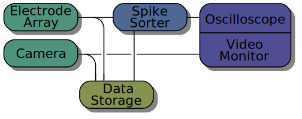

Introduction
============

What is Pyacq?
--------------

Pyacq is an open-source system for distributed data acquisition and stream
processing. Its functionality is organized into nodes that individually handle
acquisition, filtering, visualization, and recording. Nodes are created on
demand and connected to form a graph of data streams. Nodes may be created and
connected within a single thread, or distributed across multiple threads,
processes, and hosts.

   An example setup for a neurophysiology experiment.
    
The figure above shows an example use case: two data acquisition devices--a
camera and an electrode array recorded through an ADC--stream data
simultaneously to storage. The electrode data is passed through an online
spike-sorting analyzer whose output is also stored. Finally, the camera's video
feed and the online analysis are streamed to a graphical interface that
displays data as it is acquired. The nodes in the graph may run together on a
single machine or distributed across a network.

The simplified example below gives a brief overview of the code needed to create
part of the graph shown above::

    import pyacq
    
    # Connect to a remote host and create a new process there 
    manager = pyacq.create_manager('rpc')
    worker_host = manager.add_host('tcp://10.0.0.103:5678')
    worker = worker_host.create_nodegroup()
    
    # Create nodes for data acquisition, analysis, storage, and display
    device = manager.create_node('BrainAmpSocket')
    analyzer = worker.create_node('Spikesorter')
    recorder = worker.create_node('HDF5Recorder')
    viewer = pyacq.QOscilloscope()
    
    # Connect all nodes together
    analyzer.input.connect(device.output)
    recorder.input.connect(analyzer.output)
    viewer.input.connect(analyzer.output)
    
    # Begin acquiring and streaming data
    manager.start_all()
    

License
-------

???

Architecture
------------

Pyacq consists of 1) a collection of nodes with various capabilities for 
acquisition, processing, and visualization, and 2) a set of core tools that
facilitate distributed control and data streaming. 

Pyacq is built on several open-source tools including `Python 3 <http://www.python.org>`_,
`numpy <http://www.numpy.org>`_ for data handling, `ZeroMQ <http://zeromq.org/>`_
for interprocess and network communication, and 
`PyQt <https://www.riverbankcomputing.com/software/pyqt/intro>`_
for graphical user interface.

Overview of node types
----------------------

============================================= ==================================== ==================================================
**Acquisition**                               **Processing**                       **Visualization**
--------------------------------------------- ------------------------------------ --------------------------------------------------
:ref:`PyAudio <PyAudio_node>`                 :ref:`Triggering <triggering_nodes>` :ref:`Oscilloscope <analog_viewer_nodes>`
:ref:`Webcam (libav, imageio) <camera_nodes>`                                      :ref:`Wavelet spectrogram <spectral_viewer_nodes>`
:ref:`BrainAmp <BrainAmp_node>`                                                    
:ref:`Emotiv <Emotiv_node>`
============================================= ==================================== ==================================================

Installation
------------

* Pyacq requires Python 3; support for Python 2 is not planned.
* Several packages are required, but most can be installed with pip::
    
      $ pip install pyzmq pytest numpy scipy pyqtgraph vispy colorama msgpack-python pyaudio blosc

* One final dependency, PyQt4, cannot be installed with pip. Linux distributions
  typically provide this package. OSX users can get PyQt4 (and most other
  dependencies using the `Anaconda Python distribution <https://www.continuum.io/downloads>`_. 
  Windows users can also use Anaconda or download PyQt4 directly from the
  `Riverbank Computing <https://www.riverbankcomputing.com/software/pyqt/download>`_
  website.

* To install Pyacq, use the standard distutils approach::
    
      $ python setup.py install

